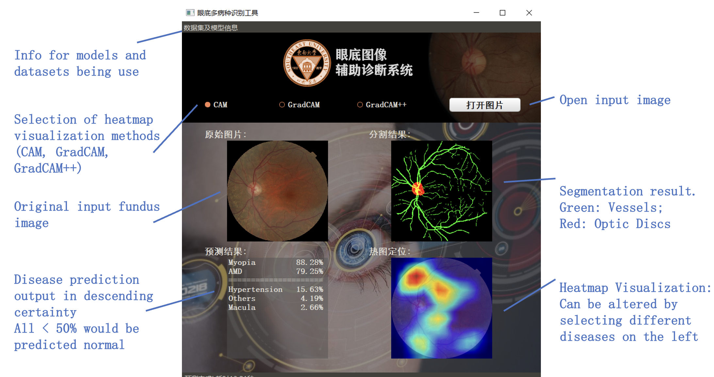

# Computer Aided Dignosis on Fundus Images
Bachelor Thesis project in SEU

## Interface of the model

To start the interface, run:

1. Download [models](https://drive.google.com/drive/folders/11HbatG3y2RKlye0Otvf1ifYeQEWm6xsR?usp=share_link) to the [saved_models foler](./saved_models/)
2. run `python main.py`

## Classification

1. A multi-class classification task using Resnet-50.
2. The trained dataset is: [KaggleDR+](https://ieeexplore.ieee.org/abstract/document/9674886) with 8 major classes and 53 minor classes.

## Detection

1. Adopt weakly-supervised method for heatmap visulization which can serve the purpose of lesion detection in a way;
2. The methods include [CAM](https://openaccess.thecvf.com/content_cvpr_2016/html/Zhou_Learning_Deep_Features_CVPR_2016_paper.html), [GradCAM](http://openaccess.thecvf.com/content_iccv_2017/html/Selvaraju_Grad-CAM_Visual_Explanations_ICCV_2017_paper.html) and [GradCAM++](https://ieeexplore.ieee.org/abstract/document/8354201).

## Segmentation

1. Use [LadderNet](https://arxiv.org/abs/1810.07810) for vessel and disc segmentation;
2. The model is trained on different datasets: [DRIVE](https://drive.grand-challenge.org) for vessel segmentation, [IDRiD](https://ieee-dataport.org/open-access/indian-diabetic-retinopathy-image-dataset-idrid) for optic disc segmentation.

